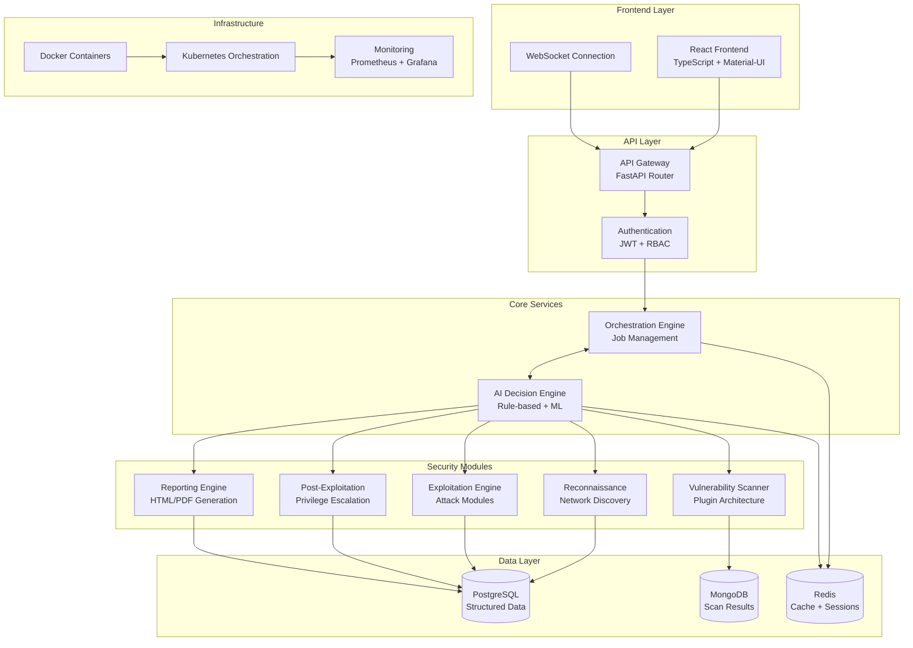

# SentinelProbe Fullstack Architecture Document

## Introduction

This document outlines the complete fullstack architecture for SentinelProbe, an AI-powered penetration testing system. It serves as the single source of truth for development, ensuring consistency across the entire technology stack including backend microservices, AI decision engine, frontend interface, and infrastructure components.

SentinelProbe is designed as a sophisticated security testing platform that combines traditional penetration testing methodologies with advanced AI-driven decision making, adaptive learning capabilities, and comprehensive vulnerability correlation analysis.

### Starter Template or Existing Project

**Status:** Active Development - Brownfield project with existing codebase
**Repository Structure:** Python package-based monorepo with separate frontend

### Change Log

| Date | Version | Description | Author |
| --- | --- | --- | --- |
| 2025-08-01 | 1.0 | Initial draft | Winston (Architect) |
| 2025-08-01 | 2.0 | Comprehensive revision with actual codebase alignment | Winston (Architect) |

## High Level Architecture

### Technical Summary

SentinelProbe is a cloud-native, containerized AI-powered penetration testing platform built with a microservices architecture. The system features:

- **Backend:** Python-based microservices using FastAPI framework
- **AI Engine:** Advanced decision-making system with rule-based logic and adaptive learning
- **Frontend:** React 19 SPA with TypeScript, Material-UI, and Vite build system
- **Data Layer:** Multi-database architecture (PostgreSQL, MongoDB, Redis)
- **Security:** Comprehensive vulnerability scanning, exploitation, and post-exploitation modules
- **Infrastructure:** Docker containerization with Kubernetes orchestration capability

### Platform and Infrastructure Choice

**Platform:** Kubernetes

**Key Services:**

- **Container Orchestration:** Kubernetes
- **Container Registry:** Docker Hub
- **CI/CD:** GitHub Actions
- **Database:** PostgreSQL, MongoDB
- **Caching:** Redis

**Deployment Host and Regions:** The application will be deployed to a cloud provider (e.g., AWS, GCP, Azure) in a single region to start, with the ability to expand to multiple regions in the future.

### Repository Structure

**Structure:** Python Package-based Monorepo

**Package Manager:** Poetry (Python), npm (Frontend)

**Organization:**

- `sentinelprobe/` - Main Python package containing all backend microservices
- `frontend/` - React application with TypeScript
- `tests/` - Comprehensive test suite (unit, integration, e2e)
- `scripts/` - Development and deployment automation
- `docs/` - Documentation and specifications

### High Level Architecture Diagram



### Architectural Patterns

- **Microservices Architecture:** Modular backend services for reconnaissance, vulnerability scanning, exploitation, and reporting
- **Plugin Architecture:** Extensible scanner and exploitation modules for different technologies
- **AI-Driven Decision Making:** Hybrid rule-based and machine learning system for intelligent test planning
- **Event-Driven Architecture:** Asynchronous job processing and real-time status updates
- **Repository Pattern:** Clean separation between data access and business logic
- **Command Query Responsibility Segregation (CQRS):** Separate read/write models for complex operations
- **Circuit Breaker Pattern:** Resilience against external service failures
- **Adaptive Learning:** Self-improving rules based on scan effectiveness feedback

## Tech Stack

| Category | Technology | Version | Purpose | Rationale |
| :--- | :--- | :--- | :--- | :--- |
| **Frontend Stack** |
| Language | TypeScript | 5.7.x | Frontend development language | Type safety, better IDE support, reduced runtime errors |
| Framework | React | 19.x | UI library | Component-based architecture, large ecosystem, hooks-based state |
| UI Library | Material-UI (MUI) | 6.x | Component library | Consistent design system, accessibility, customizable themes |
| Build Tool | Vite | 6.x | Frontend build tool | Fast HMR, modern ES modules, better DX than Webpack |
| State Management | React Hooks + Context | Built-in | Application state | Simpler than Redux, sufficient for current needs |
| HTTP Client | Axios | 1.8.x | API communication | Request/response interceptors, better error handling |
| Visualization | D3.js | 7.x | Data visualization | Powerful charting for security reports and dashboards |
| **Backend Stack** |
| Language | Python | 3.10+ | Backend development | Rich security libraries, ML ecosystem, rapid development |
| Framework | FastAPI | 0.110.x | API framework | High performance, automatic docs, async support, type hints |
| ORM | SQLAlchemy | 2.0.x | Database ORM | Advanced features, async support, type safety |
| Async Runtime | asyncio | Built-in | Asynchronous operations | Non-blocking I/O for scanning operations |
| **Data Layer** |
| Primary DB | PostgreSQL | 14+ | Structured data storage | ACID compliance, advanced features, JSON support |
| Document DB | MongoDB | 5.x | Scan results storage | Flexible schema for varied scan outputs |
| Cache/Queue | Redis | 7.x | Caching and job queues | High performance, pub/sub, session storage |
| **Security & AI** |
| ML Framework | Scikit-learn | Latest | Machine learning | Lightweight, good for classification and clustering |
| Network Scanning | Nmap | 7.x | Network reconnaissance | Industry standard, comprehensive port/service detection |
| HTTP Analysis | Requests | 2.31.x | HTTP scanning | Simple API, extensive features, session management |
| **Infrastructure** |
| Containerization | Docker | Latest | Application packaging | Consistent environments, easy deployment |
| Orchestration | Kubernetes | 1.28+ | Container orchestration | Scalability, service discovery, rolling updates |
| Process Manager | Uvicorn | 0.29.x | ASGI server | High performance, HTTP/2 support |
| **Development** |
| Testing | Pytest | 8.x | Backend testing | Fixtures, parametrization, extensive plugin ecosystem |
| Code Quality | Black, isort, flake8 | Latest | Code formatting/linting | Consistent code style, catch common issues |
| Type Checking | MyPy | 1.8.x | Static type analysis | Catch type errors before runtime |
| Dependency Mgmt | Poetry | Latest | Python package management | Deterministic builds, virtual env management |
| **Monitoring** |
| Logging | Loguru | 0.7.x | Application logging | Structured logging, better than stdlib logging |
| Metrics | Prometheus | Latest | Application metrics | Time-series metrics, alerting integration |
| Visualization | Grafana | Latest | Metrics dashboards | Rich visualization, alerting capabilities |

## Data Models

### Core Entities

#### User

**Purpose:** System users with role-based access control

**Attributes:**

- `id`: Primary key
- `username`: Unique username
- `email`: User email address
- `password_hash`: Securely hashed password
- `role`: User role (admin, analyst, viewer)
- `is_active`: Account status
- `created_at`, `updated_at`: Timestamps

#### Target

**Purpose:** Systems or networks to be tested

**Attributes:**

- `id`: Primary key
- `name`: Target identifier
- `description`: Target description
- `target_type`: Type (host, network, web_app, api)
- `host`: IP address or hostname
- `ports`: List of ports to scan
- `metadata`: Additional target information
- `risk_level`: Assessed risk level

#### Job

**Purpose:** Orchestrates penetration testing workflows

**Attributes:**

- `id`: Primary key
- `name`: Job name
- `description`: Job description
- `target_id`: Reference to target
- `status`: Job status (pending, running, completed, failed)
- `configuration`: Job parameters
- `created_by`: User who created the job
- `started_at`, `completed_at`: Execution timestamps

### AI Decision Engine Models

#### DecisionRule

**Purpose:** Rule-based decision logic for test planning

**Attributes:**

- `id`: Primary key
- `name`: Rule name
- `rule_type`: Type (service_detection, vulnerability_scan, exploitation)
- `severity`: Rule severity level
- `conditions`: JSON conditions for rule activation
- `actions`: JSON actions to execute
- `priority`: Execution priority
- `is_active`: Rule status

#### TestStrategy

**Purpose:** AI-generated testing strategies

**Attributes:**

- `id`: Primary key
- `job_id`: Associated job
- `name`: Strategy name
- `phase`: Testing phase (reconnaissance, exploitation, etc.)
- `parameters`: Strategy parameters
- `priority`: Execution priority

#### AdaptiveRule

**Purpose:** Self-improving rules based on effectiveness

**Attributes:**

- `id`: Primary key
- `base_rule_id`: Original rule reference
- `success_count`, `failure_count`: Performance metrics
- `effectiveness_score`: Calculated effectiveness (0-1)
- `version`: Rule version for evolution tracking

### Security Module Models

#### Service

**Purpose:** Discovered network services

**Attributes:**

- `id`: Primary key
- `target_id`: Associated target
- `port`: Service port number
- `protocol`: Protocol (TCP/UDP)
- `service_name`: Detected service
- `version`: Service version
- `banner`: Service banner information

#### Vulnerability

**Purpose:** Identified security vulnerabilities

**Attributes:**

- `id`: Primary key
- `cve_id`: CVE identifier (if applicable)
- `name`: Vulnerability name
- `description`: Detailed description
- `severity`: CVSS severity score
- `category`: Vulnerability category
- `affected_services`: List of affected services

#### Exploit

**Purpose:** Available exploitation methods

**Attributes:**

- `id`: Primary key
- `name`: Exploit name
- `description`: Exploit description
- `vulnerability_id`: Target vulnerability
- `exploit_type`: Type (remote, local, web)
- `reliability`: Success rate
- `payload`: Exploit payload or script

### TypeScript Interfaces

```typescript
// Core interfaces for frontend
interface Target {
  id: number;
  name: string;
  description: string;
  target_type: 'host' | 'network' | 'web_app' | 'api';
  host: string;
  ports: number[];
  risk_level: 'low' | 'medium' | 'high' | 'critical';
  metadata: Record<string, any>;
}

interface Job {
  id: number;
  name: string;
  description: string;
  target_id: number;
  status: 'pending' | 'running' | 'completed' | 'failed';
  configuration: Record<string, any>;
  created_by: number;
  started_at?: Date;
  completed_at?: Date;
}

interface Vulnerability {
  id: number;
  cve_id?: string;
  name: string;
  description: string;
  severity: number;
  category: string;
  affected_services: number[];
}

interface DecisionRule {
  id: number;
  name: string;
  rule_type: 'service_detection' | 'vulnerability_scan' | 'exploitation';
  severity: 'low' | 'medium' | 'high' | 'critical';
  conditions: Record<string, any>;
  actions: Record<string, any>;
  is_active: boolean;
  priority: number;
}
```

## API Specification

### REST API Specification

```yaml
openapi: 3.0.0
info:
  title: SentinelProbe API
  version: 2.0.0
  description: AI-Powered Penetration Testing System API
  contact:
    name: SentinelProbe Team
    url: https://github.com/sentinelprobe/sentinelprobe
servers:
  - url: /api/v1
    description: Production API base URL
paths:
  # Authentication
  /auth/login:
    post:
      summary: User authentication
      tags: [Authentication]
      requestBody:
        required: true
        content:
          application/json:
            schema:
              type: object
              properties:
                username:
                  type: string
                password:
                  type: string
      responses:
        '200':
          description: Authentication successful
          content:
            application/json:
              schema:
                type: object
                properties:
                  access_token:
                    type: string
                  token_type:
                    type: string
                  expires_in:
                    type: integer

  # Targets Management
  /targets:
    get:
      summary: List all targets
      tags: [Targets]
      security:
        - bearerAuth: []
      responses:
        '200':
          description: List of targets
          content:
            application/json:
              schema:
                type: array
                items:
                  $ref: '#/components/schemas/Target'
    post:
      summary: Create a new target
      tags: [Targets]
      security:
        - bearerAuth: []
      requestBody:
        required: true
        content:
          application/json:
            schema:
              $ref: '#/components/schemas/TargetCreate'
      responses:
        '201':
          description: Target created successfully

  /targets/{target_id}:
    get:
      summary: Get target by ID
      tags: [Targets]
      security:
        - bearerAuth: []
      parameters:
        - name: target_id
          in: path
          required: true
          schema:
            type: integer
      responses:
        '200':
          description: Target details
          content:
            application/json:
              schema:
                $ref: '#/components/schemas/Target'

  # Job Management
  /jobs:
    get:
      summary: List all jobs
      tags: [Jobs]
      security:
        - bearerAuth: []
      responses:
        '200':
          description: List of jobs
          content:
            application/json:
              schema:
                type: array
                items:
                  $ref: '#/components/schemas/Job'
    post:
      summary: Create a new penetration testing job
      tags: [Jobs]
      security:
        - bearerAuth: []
      requestBody:
        required: true
        content:
          application/json:
            schema:
              $ref: '#/components/schemas/JobCreate'
      responses:
        '201':
          description: Job created and queued for execution

  /jobs/{job_id}:
    get:
      summary: Get job status and results
      tags: [Jobs]
      security:
        - bearerAuth: []
      parameters:
        - name: job_id
          in: path
          required: true
          schema:
            type: integer
      responses:
        '200':
          description: Job details with status and results

  /jobs/{job_id}/stop:
    post:
      summary: Stop a running job
      tags: [Jobs]
      security:
        - bearerAuth: []
      parameters:
        - name: job_id
          in: path
          required: true
          schema:
            type: integer
      responses:
        '200':
          description: Job stop requested

  # AI Decision Engine
  /ai/rules:
    get:
      summary: List decision rules
      tags: [AI Decision Engine]
      security:
        - bearerAuth: []
      responses:
        '200':
          description: List of decision rules
          content:
            application/json:
              schema:
                type: array
                items:
                  $ref: '#/components/schemas/DecisionRule'
    post:
      summary: Create a new decision rule
      tags: [AI Decision Engine]
      security:
        - bearerAuth: []
      requestBody:
        required: true
        content:
          application/json:
            schema:
              $ref: '#/components/schemas/DecisionRuleCreate'
      responses:
        '201':
          description: Decision rule created

  /ai/strategies/{job_id}:
    get:
      summary: Get AI-generated test strategies for a job
      tags: [AI Decision Engine]
      security:
        - bearerAuth: []
      parameters:
        - name: job_id
          in: path
          required: true
          schema:
            type: integer
      responses:
        '200':
          description: Generated test strategies
          content:
            application/json:
              schema:
                type: array
                items:
                  $ref: '#/components/schemas/TestStrategy'

  # Vulnerabilities
  /vulnerabilities:
    get:
      summary: List discovered vulnerabilities
      tags: [Vulnerabilities]
      security:
        - bearerAuth: []
      parameters:
        - name: job_id
          in: query
          schema:
            type: integer
        - name: severity
          in: query
          schema:
            type: string
            enum: [low, medium, high, critical]
      responses:
        '200':
          description: List of vulnerabilities
          content:
            application/json:
              schema:
                type: array
                items:
                  $ref: '#/components/schemas/Vulnerability'

  # Reports
  /reports/{job_id}:
    get:
      summary: Generate and download job report
      tags: [Reports]
      security:
        - bearerAuth: []
      parameters:
        - name: job_id
          in: path
          required: true
          schema:
            type: integer
        - name: format
          in: query
          schema:
            type: string
            enum: [html, pdf, json]
            default: html
      responses:
        '200':
          description: Generated report
          content:
            application/html:
              schema:
                type: string
            application/pdf:
              schema:
                type: string
                format: binary
            application/json:
              schema:
                type: object

  # Real-time Updates
  /ws/jobs/{job_id}:
    get:
      summary: WebSocket endpoint for real-time job updates
      tags: [WebSocket]
      description: WebSocket connection for receiving real-time job status updates
      parameters:
        - name: job_id
          in: path
          required: true
          schema:
            type: integer

components:
  securitySchemes:
    bearerAuth:
      type: http
      scheme: bearer
      bearerFormat: JWT

  schemas:
    Target:
      type: object
      properties:
        id:
          type: integer
        name:
          type: string
        description:
          type: string
        target_type:
          type: string
          enum: [host, network, web_app, api]
        host:
          type: string
        ports:
          type: array
          items:
            type: integer
        risk_level:
          type: string
          enum: [low, medium, high, critical]
        metadata:
          type: object

    TargetCreate:
      type: object
      required: [name, target_type, host]
      properties:
        name:
          type: string
        description:
          type: string
        target_type:
          type: string
          enum: [host, network, web_app, api]
        host:
          type: string
        ports:
          type: array
          items:
            type: integer
        metadata:
          type: object

    Job:
      type: object
      properties:
        id:
          type: integer
        name:
          type: string
        description:
          type: string
        target_id:
          type: integer
        status:
          type: string
          enum: [pending, running, completed, failed, stopped]
        configuration:
          type: object
        created_by:
          type: integer
        started_at:
          type: string
          format: date-time
        completed_at:
          type: string
          format: date-time

    JobCreate:
      type: object
      required: [name, target_id]
      properties:
        name:
          type: string
        description:
          type: string
        target_id:
          type: integer
        configuration:
          type: object

    DecisionRule:
      type: object
      properties:
        id:
          type: integer
        name:
          type: string
        rule_type:
          type: string
          enum: [service_detection, vulnerability_scan, exploitation, post_exploitation, reporting]
        severity:
          type: string
          enum: [low, medium, high, critical]
        conditions:
          type: object
        actions:
          type: object
        is_active:
          type: boolean
        priority:
          type: integer

    DecisionRuleCreate:
      type: object
      required: [name, rule_type, conditions, actions]
      properties:
        name:
          type: string
        rule_type:
          type: string
          enum: [service_detection, vulnerability_scan, exploitation, post_exploitation, reporting]
        severity:
          type: string
          enum: [low, medium, high, critical]
        conditions:
          type: object
        actions:
          type: object
        priority:
          type: integer
          default: 100

    TestStrategy:
      type: object
      properties:
        id:
          type: integer
        job_id:
          type: integer
        name:
          type: string
        description:
          type: string
        phase:
          type: string
          enum: [reconnaissance, vulnerability_scan, exploitation, post_exploitation, reporting]
        parameters:
          type: object
        priority:
          type: integer

    Vulnerability:
      type: object
      properties:
        id:
          type: integer
        cve_id:
          type: string
        name:
          type: string
        description:
          type: string
        severity:
          type: number
          format: float
          minimum: 0
          maximum: 10
        category:
          type: string
        affected_services:
          type: array
          items:
            type: integer
```

## System Components

### Frontend Layer

#### React Application

**Responsibility:** User interface for penetration testing operations

**Key Features:**

- **Dashboard:** Real-time job monitoring and system overview
- **Target Management:** Create and manage testing targets
- **Job Control:** Start, monitor, and control penetration testing jobs
- **Results Viewer:** Interactive vulnerability analysis and reporting
- **AI Insights:** Visualize AI decision-making and rule effectiveness
- **Settings:** User preferences and system configuration

**Architecture:**

- **State Management:** React Hooks + Context API for local state
- **Routing:** React Router for SPA navigation
- **Real-time Updates:** WebSocket connections for live job status
- **Data Visualization:** D3.js for security metrics and network topology
- **Responsive Design:** Material-UI components with custom themes

**Dependencies:** Backend API, WebSocket server

### Backend Microservices

#### API Gateway Service

**Responsibility:** Single entry point for all client requests

**Features:**

- Request routing and load balancing
- Authentication and authorization (JWT)
- Rate limiting and request validation
- CORS handling and security headers
- API documentation (Swagger/OpenAPI)

#### Orchestration Engine

**Responsibility:** Job lifecycle management and workflow coordination

**Features:**

- Job queue management with Redis
- Workflow state machine implementation
- Resource allocation and scheduling
- Inter-service communication coordination
- Job status tracking and persistence

#### AI Decision Engine

**Responsibility:** Intelligent test planning and adaptive learning

**Core Components:**

- **Rule Engine:** Process decision rules for test planning
- **Strategy Generator:** Create optimized testing strategies
- **Adaptive Learning:** Improve rules based on effectiveness feedback
- **Vulnerability Correlation:** Identify related security issues
- **Contextual Scoring:** Adjust severity based on environment

**Machine Learning Features:**

- Classification algorithms for vulnerability prioritization
- Pattern recognition for attack path discovery
- Anomaly detection for unusual network behavior
- Clustering for similar vulnerability grouping

#### Security Modules

##### Reconnaissance Service

**Responsibility:** Network discovery and service enumeration

**Capabilities:**

- **Network Discovery:** Host detection via ICMP, ARP, and TCP ping
- **Port Scanning:** TCP/UDP port scanning with timing optimization
- **Service Detection:** Banner grabbing and service fingerprinting
- **OS Fingerprinting:** Operating system identification
- **Network Topology Mapping:** Subnet and routing discovery

**Plugin Architecture:**

- Nmap integration for comprehensive scanning
- Custom Python scanners for specific protocols
- Passive reconnaissance via DNS and WHOIS
- Social media and public data gathering

##### Vulnerability Scanner Service

**Responsibility:** Security vulnerability identification

**Scanner Types:**

- **Network Scanners:** Protocol-specific vulnerability detection
- **Web Application Scanners:** OWASP Top 10 and custom checks
- **Database Scanners:** Database-specific security assessments
- **Configuration Scanners:** Security misconfigurations

**Plugin System:**

- HTTP/HTTPS web application scanning
- SSH service vulnerability detection
- MySQL/PostgreSQL/MongoDB database scanning
- Redis and other NoSQL database testing
- Custom protocol scanners

##### Exploitation Engine

**Responsibility:** Vulnerability exploitation and proof-of-concept

**Capabilities:**

- **Exploit Database:** CVE-mapped exploit modules
- **Custom Payloads:** Language-specific payload generation
- **Post-Exploitation:** Privilege escalation and persistence
- **Evidence Collection:** Screenshot and data extraction
- **Safe Mode:** Non-destructive testing options

**Safety Features:**

- Exploit reliability scoring
- Rollback and cleanup mechanisms
- Target impact assessment
- Controlled payload execution

##### Reporting Engine

**Responsibility:** Comprehensive security report generation

**Report Types:**

- **Executive Summary:** High-level findings for management
- **Technical Report:** Detailed vulnerability analysis
- **Remediation Guide:** Step-by-step fix instructions
- **Compliance Reports:** Regulatory compliance mapping

**Export Formats:**

- Interactive HTML reports with charts
- PDF reports for sharing and archival
- JSON/XML for integration with other tools
- Custom templates for organizational branding

### Data Layer

#### PostgreSQL (Primary Database)

**Purpose:** Structured data storage for core entities

**Schema Design:**

- User management and authentication
- Job and target definitions
- AI decision rules and strategies
- System configuration and metadata
- Audit logs and user activity tracking

#### MongoDB (Document Store)

**Purpose:** Flexible storage for scan results and findings

**Collections:**

- Raw scan outputs and tool results
- Network topology and service data
- Vulnerability details and evidence
- Exploit results and proof-of-concept data
- Large binary data (screenshots, files)

#### Redis (Cache and Queue)

**Purpose:** High-performance caching and job queuing

**Use Cases:**

- Job queue management with priorities
- Session storage and user state
- Caching frequently accessed data
- Real-time pub/sub for WebSocket updates
- Rate limiting and API throttling

### Security and Compliance Framework

#### Authentication and Authorization

- **JWT-based Authentication:** Stateless token-based auth
- **Role-Based Access Control (RBAC):** Admin, Analyst, Viewer roles
- **API Key Management:** Service-to-service authentication
- **Session Management:** Secure session handling with Redis

#### Security Measures

- **Input Validation:** Comprehensive request validation
- **SQL Injection Prevention:** Parameterized queries and ORM
- **XSS Protection:** Content Security Policy and output encoding
- **CSRF Protection:** Token-based CSRF prevention
- **Secure Headers:** HSTS, X-Frame-Options, etc.

#### Compliance and Auditing

- **Audit Logging:** Comprehensive action logging
- **Data Encryption:** At-rest and in-transit encryption
- **Access Logging:** User activity tracking
- **Compliance Reporting:** SOC 2, ISO 27001 alignment

### Infrastructure Components

#### Containerization (Docker)

- Multi-stage builds for optimized images
- Security scanning of container images
- Non-root user execution
- Minimal base images (Alpine/Distroless)

#### Orchestration (Kubernetes)

- Horizontal pod autoscaling
- Rolling deployments with zero downtime
- Service mesh for secure inter-service communication
- Resource limits and quality of service

#### Monitoring and Observability

- **Metrics:** Prometheus for time-series metrics
- **Logging:** Structured logging with log aggregation
- **Tracing:** Distributed tracing for request flows
- **Alerting:** Grafana dashboards and alerting rules
- **Health Checks:** Liveness and readiness probes

## Database Schema

### PostgreSQL Schema

```sql
-- Core entities
CREATE TABLE users (
    id SERIAL PRIMARY KEY,
    username VARCHAR(255) UNIQUE NOT NULL,
    email VARCHAR(255) UNIQUE NOT NULL,
    password_hash VARCHAR(255) NOT NULL,
    role VARCHAR(50) NOT NULL DEFAULT 'analyst',
    is_active BOOLEAN NOT NULL DEFAULT TRUE,
    created_at TIMESTAMP NOT NULL DEFAULT NOW(),
    updated_at TIMESTAMP NOT NULL DEFAULT NOW()
);

CREATE TABLE targets (
    id SERIAL PRIMARY KEY,
    name VARCHAR(255) NOT NULL,
    description TEXT,
    target_type VARCHAR(50) NOT NULL,
    host VARCHAR(255) NOT NULL,
    ports INTEGER[],
    risk_level VARCHAR(20) NOT NULL DEFAULT 'medium',
    metadata JSONB DEFAULT '{}',
    created_at TIMESTAMP NOT NULL DEFAULT NOW(),
    updated_at TIMESTAMP NOT NULL DEFAULT NOW()
);

CREATE TABLE jobs (
    id SERIAL PRIMARY KEY,
    name VARCHAR(255) NOT NULL,
    description TEXT,
    target_id INTEGER NOT NULL REFERENCES targets(id),
    status VARCHAR(50) NOT NULL DEFAULT 'pending',
    configuration JSONB DEFAULT '{}',
    created_by INTEGER NOT NULL REFERENCES users(id),
    started_at TIMESTAMP,
    completed_at TIMESTAMP,
    created_at TIMESTAMP NOT NULL DEFAULT NOW(),
    updated_at TIMESTAMP NOT NULL DEFAULT NOW()
);

-- AI Decision Engine tables
CREATE TABLE decision_rules (
    id SERIAL PRIMARY KEY,
    name VARCHAR(255) NOT NULL,
    description TEXT NOT NULL,
    rule_type VARCHAR(50) NOT NULL,
    severity VARCHAR(20) NOT NULL,
    conditions JSONB NOT NULL,
    actions JSONB NOT NULL,
    is_active BOOLEAN NOT NULL DEFAULT TRUE,
    priority INTEGER NOT NULL DEFAULT 100,
    rule_metadata JSONB DEFAULT '{}',
    created_at TIMESTAMP NOT NULL DEFAULT NOW(),
    updated_at TIMESTAMP NOT NULL DEFAULT NOW()
);

CREATE TABLE test_strategies (
    id SERIAL PRIMARY KEY,
    job_id INTEGER NOT NULL REFERENCES jobs(id),
    name VARCHAR(255) NOT NULL,
    description TEXT,
    phase VARCHAR(50) NOT NULL,
    parameters JSONB DEFAULT '{}',
    strategy_metadata JSONB DEFAULT '{}',
    is_active BOOLEAN NOT NULL DEFAULT TRUE,
    priority INTEGER NOT NULL DEFAULT 100,
    created_at TIMESTAMP NOT NULL DEFAULT NOW(),
    updated_at TIMESTAMP NOT NULL DEFAULT NOW()
);

CREATE TABLE adaptive_rules (
    id SERIAL PRIMARY KEY,
    base_rule_id INTEGER REFERENCES decision_rules(id),
    name VARCHAR(255) NOT NULL,
    description TEXT NOT NULL,
    rule_type VARCHAR(50) NOT NULL,
    conditions JSONB NOT NULL,
    actions JSONB NOT NULL,
    success_count INTEGER NOT NULL DEFAULT 0,
    failure_count INTEGER NOT NULL DEFAULT 0,
    effectiveness_score FLOAT NOT NULL DEFAULT 0.5,
    confidence VARCHAR(20) NOT NULL DEFAULT 'medium',
    is_active BOOLEAN NOT NULL DEFAULT TRUE,
    version INTEGER NOT NULL DEFAULT 1,
    adaptive_metadata JSONB DEFAULT '{}',
    created_at TIMESTAMP NOT NULL DEFAULT NOW(),
    updated_at TIMESTAMP NOT NULL DEFAULT NOW()
);

CREATE TABLE knowledge_items (
    id SERIAL PRIMARY KEY,
    target_id INTEGER REFERENCES targets(id),
    key VARCHAR(255) NOT NULL,
    value_type VARCHAR(50) NOT NULL,
    string_value VARCHAR(1000),
    int_value INTEGER,
    float_value FLOAT,
    bool_value BOOLEAN,
    json_value JSONB,
    confidence VARCHAR(20) NOT NULL DEFAULT 'medium',
    item_metadata JSONB DEFAULT '{}',
    created_at TIMESTAMP NOT NULL DEFAULT NOW(),
    updated_at TIMESTAMP NOT NULL DEFAULT NOW()
);

-- Security module tables
CREATE TABLE services (
    id SERIAL PRIMARY KEY,
    target_id INTEGER NOT NULL REFERENCES targets(id),
    port INTEGER NOT NULL,
    protocol VARCHAR(10) NOT NULL,
    service_name VARCHAR(255),
    version VARCHAR(255),
    banner TEXT,
    metadata JSONB DEFAULT '{}',
    discovered_at TIMESTAMP NOT NULL DEFAULT NOW()
);

CREATE TABLE vulnerabilities (
    id SERIAL PRIMARY KEY,
    cve_id VARCHAR(50),
    name VARCHAR(255) NOT NULL,
    description TEXT NOT NULL,
    severity FLOAT NOT NULL,
    category VARCHAR(100) NOT NULL,
    affected_services INTEGER[],
    metadata JSONB DEFAULT '{}',
    created_at TIMESTAMP NOT NULL DEFAULT NOW(),
    updated_at TIMESTAMP NOT NULL DEFAULT NOW()
);

CREATE TABLE exploits (
    id SERIAL PRIMARY KEY,
    name VARCHAR(255) NOT NULL,
    description TEXT NOT NULL,
    vulnerability_id INTEGER NOT NULL REFERENCES vulnerabilities(id),
    exploit_type VARCHAR(50) NOT NULL,
    reliability FLOAT NOT NULL DEFAULT 0.5,
    payload TEXT,
    metadata JSONB DEFAULT '{}',
    created_at TIMESTAMP NOT NULL DEFAULT NOW(),
    updated_at TIMESTAMP NOT NULL DEFAULT NOW()
);

-- Association tables
CREATE TABLE rules_strategies (
    rule_id INTEGER NOT NULL REFERENCES decision_rules(id),
    strategy_id INTEGER NOT NULL REFERENCES test_strategies(id),
    PRIMARY KEY (rule_id, strategy_id)
);

-- Indexes for performance
CREATE INDEX idx_jobs_status ON jobs(status);
CREATE INDEX idx_jobs_target_id ON jobs(target_id);
CREATE INDEX idx_services_target_id ON services(target_id);
CREATE INDEX idx_knowledge_items_target_id ON knowledge_items(target_id);
CREATE INDEX idx_decision_rules_type ON decision_rules(rule_type);
CREATE INDEX idx_decision_rules_active ON decision_rules(is_active);
```

### MongoDB Collections

#### Scan Results Collection

```javascript
// Collection: scan_results
{
  _id: ObjectId,
  job_id: 123,
  target_id: 456,
  scan_type: "nmap_tcp_scan",
  timestamp: ISODate("2024-01-01T12:00:00Z"),
  status: "completed",
  raw_output: "...", // Raw tool output
  parsed_results: {
    hosts: [
      {
        ip: "192.168.1.100",
        status: "up",
        ports: [
          {
            port: 22,
            protocol: "tcp",
            state: "open",
            service: "ssh",
            version: "OpenSSH 8.0"
          }
        ]
      }
    ]
  },
  metadata: {
    tool_version: "nmap-7.94",
    scan_duration: 45.2,
    command_line: "nmap -sS -O target"
  }
}
```

#### Vulnerability Findings Collection

```javascript
// Collection: vulnerability_findings
{
  _id: ObjectId,
  job_id: 123,
  target_id: 456,
  service_id: 789,
  vulnerability: {
    cve_id: "CVE-2023-1234",
    name: "SSH Weak Encryption",
    description: "SSH server supports weak encryption algorithms",
    severity: 7.5,
    cvss_vector: "CVSS:3.1/AV:N/AC:L/PR:N/UI:N/S:U/C:H/I:N/A:N"
  },
  evidence: {
    proof_of_concept: "ssh -c aes128-cbc target",
    screenshots: ["base64_encoded_image"],
    network_traffic: "base64_encoded_pcap"
  },
  remediation: {
    description: "Disable weak encryption algorithms",
    steps: [
      "Edit /etc/ssh/sshd_config",
      "Add: Ciphers aes256-gcm@openssh.com,aes128-gcm@openssh.com",
      "Restart SSH service"
    ]
  },
  discovered_at: ISODate("2024-01-01T12:30:00Z"),
  verified: true,
  false_positive: false
}
```

#### Exploitation Results Collection

```javascript
// Collection: exploitation_results
{
  _id: ObjectId,
  job_id: 123,
  vulnerability_finding_id: ObjectId("..."),
  exploit_id: 456,
  attempt_timestamp: ISODate("2024-01-01T13:00:00Z"),
  status: "successful",
  payload_used: {
    type: "reverse_shell",
    parameters: {
      lhost: "192.168.1.50",
      lport: 4444
    }
  },
  results: {
    access_gained: true,
    privilege_level: "user",
    shell_type: "bash",
    evidence: {
      command_output: "uid=1000(user) gid=1000(user) groups=1000(user)",
      screenshots: ["base64_encoded_image"]
    }
  },
  cleanup_performed: true,
  impact_assessment: {
    confidentiality: "high",
    integrity: "medium",
    availability: "low"
  }
}
```

#### Network Topology Collection

```javascript
// Collection: network_topology
{
  _id: ObjectId,
  job_id: 123,
  discovery_timestamp: ISODate("2024-01-01T11:00:00Z"),
  network_map: {
    subnets: [
      {
        cidr: "192.168.1.0/24",
        gateway: "192.168.1.1",
        hosts: [
          {
            ip: "192.168.1.100",
            mac: "00:11:22:33:44:55",
            hostname: "server01.local",
            os_guess: "Linux 4.15-5.4",
            response_time: 0.045
          }
        ]
      }
    ],
    routes: [
      {
        destination: "0.0.0.0/0",
        gateway: "192.168.1.1",
        interface: "eth0"
      }
    ]
  }
}
```

## Unified Project Structure

```

SentinelProbe/
├── .github/
│   └── workflows/
│       ├── ci.yaml
│       └── deploy.yaml
├── frontend/
│   ├── src/
│   │   ├── components/
│   │   ├── pages/
│   │   ├── hooks/
│   │   ├── services/
│   │   ├── stores/
│   │   ├── styles/
│   │   └── utils/
│   ├── public/
│   ├── tests/
│   └── package.json
├── backend/
│   ├── src/
│   │   ├── api/
│   │   ├── services/
│   │   ├── models/
│   │   ├── middleware/
│   │   └── utils/
│   ├── tests/
│   └── requirements.txt
├── infrastructure/
│   └── terraform/
├── scripts/
├── docs/
│   ├── prd.md
│   ├── front-end-spec.md
│   └── architecture.md
├── .env.example
├── package.json
└── README.md

### Key Architecture Decisions

#### 1. **Python Package Structure**
- Single `sentinelprobe/` package containing all backend services
- Each module (reconnaissance, vulnerability_scanner, etc.) is self-contained
- Shared core components (db, config, logging) in `core/` module

#### 2. **Plugin Architecture**
- Extensible scanner plugins in `vulnerability_scanner/plugins/`
- Exploitation modules in `exploitation/plugins/`
- Post-exploitation techniques in `post_exploitation/techniques/`

#### 3. **AI Integration**
- Dedicated `ai_decision/` module for intelligent decision making
- Adaptive learning capabilities with rule evolution
- Vulnerability correlation and contextual scoring

#### 4. **Testing Strategy**
- Comprehensive test coverage across all modules
- Integration tests for end-to-end workflows
- Mock repositories for isolated unit testing

#### 5. **Development Workflow**
- Poetry for Python dependency management
- Pre-commit hooks for code quality
- Docker for consistent development environments
- Automated testing and linting scripts

## Performance and Scalability Considerations

### Horizontal Scaling
- **Microservices Design:** Each security module can be scaled independently
- **Kubernetes Deployment:** Container orchestration for automatic scaling
- **Load Balancing:** API Gateway distributes requests across service instances
- **Database Sharding:** MongoDB collections can be sharded by job_id or target_id

### Performance Optimization
- **Async Processing:** All I/O operations use asyncio for non-blocking execution
- **Connection Pooling:** Database connections are pooled and reused
- **Caching Strategy:** Redis caches frequently accessed data and API responses
- **Query Optimization:** Database indexes on commonly queried fields

### Resource Management
- **Job Queuing:** Redis-based job queues prevent system overload
- **Rate Limiting:** API rate limiting prevents abuse and ensures fair usage
- **Resource Limits:** Kubernetes resource limits prevent resource exhaustion
- **Circuit Breakers:** Prevent cascade failures in distributed system

## Security Considerations

### Application Security
- **Input Validation:** Comprehensive validation of all user inputs
- **Authentication:** JWT-based stateless authentication
- **Authorization:** Role-based access control (RBAC)
- **SQL Injection Prevention:** Parameterized queries and ORM usage
- **XSS Protection:** Content Security Policy and output encoding

### Infrastructure Security
- **Container Security:** Non-root containers with minimal attack surface
- **Network Security:** Service mesh for encrypted inter-service communication
- **Secrets Management:** Kubernetes secrets for sensitive configuration
- **TLS Encryption:** All communication encrypted in transit

### Penetration Testing Tool Security
- **Controlled Execution:** Safe mode for non-destructive testing
- **Audit Logging:** Comprehensive logging of all security testing activities
- **Access Controls:** Strict controls on who can run penetration tests
- **Evidence Chain:** Secure storage and handling of security evidence

## Deployment Architecture

### Development Environment
```yaml
# docker-compose.yml for local development
version: '3.8'
services:
  api:
    build: .
    ports:
      - "8000:8000"
    environment:
      - DEBUG=true
    depends_on:
      - postgres
      - mongodb
      - redis
  
  postgres:
    image: postgres:14
    environment:
      POSTGRES_DB: sentinelprobe
      POSTGRES_USER: postgres
      POSTGRES_PASSWORD: postgres
    volumes:
      - postgres_data:/var/lib/postgresql/data
  
  mongodb:
    image: mongo:5
    volumes:
      - mongodb_data:/data/db
  
  redis:
    image: redis:7-alpine
    volumes:
      - redis_data:/data

volumes:
  postgres_data:
  mongodb_data:
  redis_data:
```

### Production Deployment (Kubernetes)

```yaml
# k8s/deployment.yaml
apiVersion: apps/v1
kind: Deployment
metadata:
  name: sentinelprobe-api
spec:
  replicas: 3
  selector:
    matchLabels:
      app: sentinelprobe-api
  template:
    metadata:
      labels:
        app: sentinelprobe-api
    spec:
      containers:
      - name: api
        image: sentinelprobe/api:latest
        ports:
        - containerPort: 8000
        env:
        - name: DATABASE_URL
          valueFrom:
            secretKeyRef:
              name: sentinelprobe-secrets
              key: database-url
        resources:
          requests:
            memory: "256Mi"
            cpu: "250m"
          limits:
            memory: "512Mi"
            cpu: "500m"
        livenessProbe:
          httpGet:
            path: /api/v1/health
            port: 8000
          initialDelaySeconds: 30
          periodSeconds: 10
        readinessProbe:
          httpGet:
            path: /api/v1/health
            port: 8000
          initialDelaySeconds: 5
          periodSeconds: 5
```

## Monitoring and Observability

### Application Metrics

- **Response Time:** API endpoint response times
- **Error Rates:** HTTP error rates and application exceptions
- **Throughput:** Requests per second and job completion rates
- **Resource Usage:** CPU, memory, and disk utilization

### Business Metrics

- **Job Success Rate:** Percentage of successfully completed penetration tests
- **Vulnerability Detection Rate:** Number of vulnerabilities found per scan
- **AI Decision Accuracy:** Effectiveness of AI-driven test strategies
- **User Activity:** Active users and usage patterns

### Alerting Rules

- **High Error Rate:** Alert when API error rate exceeds 5%
- **Slow Response Time:** Alert when response time exceeds 2 seconds
- **Resource Exhaustion:** Alert when CPU/memory usage exceeds 80%
- **Failed Jobs:** Alert when job failure rate exceeds 10%

## Future Enhancements

### Planned Features

1. **Machine Learning Integration:** Advanced ML models for vulnerability prediction
2. **Cloud Provider Integration:** Direct integration with AWS, Azure, GCP security services
3. **Compliance Frameworks:** Built-in compliance checking for SOC 2, ISO 27001, PCI DSS
4. **Mobile Application:** Mobile app for monitoring and basic control
5. **API Integrations:** Integration with popular security tools (SIEM, ticketing systems)

### Scalability Roadmap

1. **Multi-tenancy:** Support for multiple organizations in single deployment
2. **Global Deployment:** Multi-region deployment for global organizations
3. **Edge Computing:** Edge nodes for distributed penetration testing
4. **Real-time Analytics:** Stream processing for real-time security insights

---

*This architecture document serves as the definitive guide for SentinelProbe development. It should be updated as the system evolves and new requirements emerge.*
