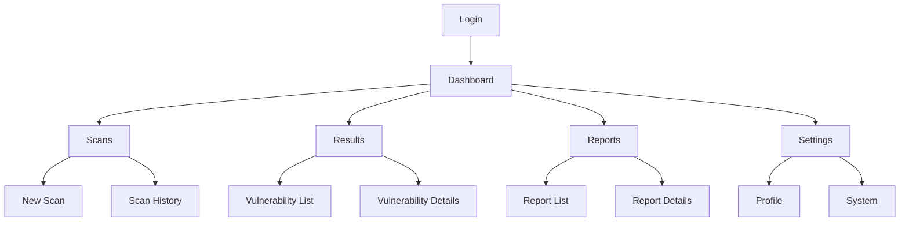
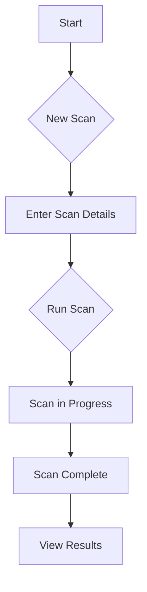

# SentinelProbe UI/UX Specification

## Introduction

This document defines the user experience goals, information architecture, user flows, and visual design specifications for SentinelProbe's user interface. It serves as the foundation for visual design and frontend development, ensuring a cohesive and user-centered experience.

### Overall UX Goals & Principles

#### Target User Personas

*   **Security Professionals:** Technical users who need a powerful and flexible interface to manage scans, analyze results, and customize the tool to their needs.
*   **DevOps Teams:** Users who need a simple and intuitive interface to integrate security testing into their CI/CD pipeline and quickly identify and fix vulnerabilities.

#### Usability Goals

*   **Ease of Use:** The interface should be intuitive and easy to navigate, even for users who are not security experts.
*   **Efficiency:** The interface should allow users to complete their tasks quickly and efficiently.
*   **Clarity:** The interface should present information in a clear and concise way, making it easy for users to understand the results of their scans.

#### Design Principles

1.  **Clarity over cleverness:** Prioritize clear communication over aesthetic innovation.
2.  **Progressive disclosure:** Show only what's needed, when it's needed.
3.  **Consistent patterns:** Use familiar UI patterns throughout the application.

### Change Log

| Date | Version | Description | Author |
| --- | --- | --- | --- |
| 2025-08-01 | 1.0 | Initial draft | Sally (UX Expert) |

## Information Architecture (IA)

### Site Map / Screen Inventory

### Navigation Structure

**Primary Navigation:**

*   Dashboard
*   Scans
*   Results
*   Reports
*   Settings

**Secondary Navigation:**

*   **Scans:** New Scan, Scan History
*   **Results:** Vulnerability List, Vulnerability Details
*   **Reports:** Report List, Report Details
*   **Settings:** Profile, System

**Breadcrumb Strategy:**

A breadcrumb navigation will be used to show the user's current location in the application.

## User Flows

### Create and Run a Scan

**User Goal:** To create and run a new scan.

**Entry Points:**

*   "New Scan" button on the Dashboard.
*   "New Scan" button in the Scans section.

**Success Criteria:**

The user is able to create a new scan, run it, and view the results.

**Flow Diagram:**

**Edge Cases & Error Handling:**

*   Invalid scan parameters.
*   Scan fails to start.
*   Scan is cancelled.

**Notes:**

The user should be able to save a scan configuration as a template to be used for future scans.

## Wireframes & Mockups

**Primary Design Files:**

[Link to Figma/Sketch file]

### Key Screen Layouts

#### Dashboard

**Purpose:** To provide a high-level overview of the system status and recent activity.

**Key Elements:**

*   Summary of active scans.
*   List of recent results.
*   Quick access to common actions (e.g., New Scan).

**Interaction Notes:**

The dashboard should be customizable to allow users to show the information that is most important to them.

**Design File Reference:**

[Link to specific frame in design file]

## Component Library / Design System

**Design System Approach:**

A new design system will be created for SentinelProbe, based on Material Design principles.

### Core Components

#### Button

**Purpose:** To allow users to perform actions.

**Variants:** Primary, Secondary, Tertiary

**States:** Default, Hover, Pressed, Disabled

**Usage Guidelines:**

*   Primary buttons should be used for the main call to action on a page.
*   Secondary buttons should be used for secondary actions.
*   Tertiary buttons should be used for less important actions.

## Branding & Style Guide

**Visual Identity:**

[Link to brand guidelines]

### Color Palette

| Color Type | Hex Code | Usage |
| :--- | :--- | :--- |
| Primary | #007bff | Buttons, links, and other interactive elements |
| Secondary | #6c757d | Secondary text, borders, and backgrounds |
| Accent | #ffc107 | Highlights, warnings, and other important information |
| Success | #28a745 | Success messages and confirmations |
| Warning | #ffc107 | Warnings and important notices |
| Error | #dc3545 | Error messages and destructive actions |
| Neutral | #f8f9fa, #e9ecef, #dee2e6, #ced4da, #adb5bd, #6c757d, #495057, #343a40, #212529 | Text, borders, and backgrounds |

### Typography

#### Font Families

*   **Primary:** Roboto
*   **Monospace:** Roboto Mono

#### Type Scale

| Element | Size | Weight | Line Height |
| :--- | :--- | :--- | :--- |
| H1 | 2.5rem | 700 | 1.2 |
| H2 | 2rem | 700 | 1.2 |
| H3 | 1.75rem | 700 | 1.2 |
| Body | 1rem | 400 | 1.5 |
| Small | 0.875rem | 400 | 1.5 |

## Accessibility Requirements

**Standard:** WCAG 2.1 AA

## Responsiveness Strategy

**Breakpoints:**

| Breakpoint | Min Width | Max Width | Target Devices |
| :--- | :--- | :--- | :--- |
| Mobile | 320px | 767px | Smartphones |
| Tablet | 768px | 1023px | Tablets |
| Desktop | 1024px | - | Desktops |

## Animation & Micro-interactions

**Motion Principles:**

Animations should be used to provide feedback to the user and to make the interface feel more responsive. Animations should be subtle and not distracting.

## Performance Considerations

**Performance Goals:**

*   **Page Load:** < 2 seconds
*   **Interaction Response:** < 100ms

## Next Steps

### Immediate Actions

1.  Review the UI/UX specification with stakeholders.
2.  Create visual designs in Figma.
3.  Prepare for handoff to the front-end architect.

### Design Handoff Checklist

*   [x] All user flows documented
*   [x] Component inventory complete
*   [x] Accessibility requirements defined
*   [x] Responsive strategy clear
*   [x] Brand guidelines incorporated
*   [x] Performance goals established
