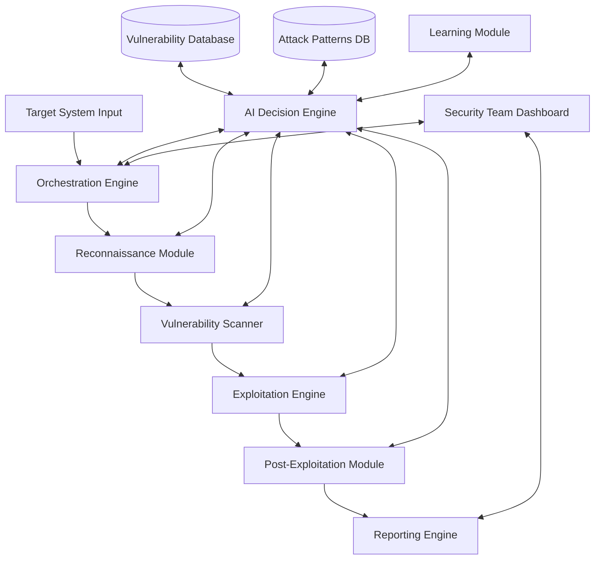

# System Architecture

## Reconnaissance Methods

This solution incorporates both passive OSINT and active API/network reconnaissance, with optional AI-assisted automation.

### Passive Reconnaissance (OSINT)
- Google Dorking: site/domain queries for OpenAPI/Swagger, keys, tokens, headers
- GitHub Dorking: filename:swagger.json, extension:.json, "api key", "authorization: Bearer", tokens
- Certificate Transparency: crt.sh, Censys; enumerate API subdomains from SANs
- Wayback Machine: recover historical API docs/routes
- Internet-wide search: Shodan/Censys for exposed API tech/services
- Secrets discovery: TruffleHog/Gitleaks over public repos and artifacts

### Active API Reconnaissance
- Nmap: general detection (-sC -sV), all-ports (-p-), HTTP enum (http-enum)
- Amass: subdomain enumeration (active/passive)
- API surface discovery: Kiterunner (methods + route semantics), Gobuster/ffuf (paths)
- Spec harvesting: probe common paths (/swagger.json, /openapi.json, /api-docs)
- Protocol discovery: GraphQL introspection, gRPC reflection, SOAP/WSDL
- Response fingerprinting: headers, CORS, auth schemes, JSON schema clustering

### AI/LLM-Assisted Automations (optional)
- Dork generation and search planning from org/app context
- OpenAPI summarization and endpoint/risk extraction
- Secrets/PII triage from OSINT artifacts (rules + LLM assist)
- Endpoint prediction to seed Kiterunner/ffuf wordlists
- Banner classification (light ML) and anomaly clustering with labels
- Business-logic hypothesis to guide targeted testing

See `docs/wiki/components/reconnaissance.md` for module details and configuration.

### Tooling (Python-compatible)
- Subdomain Enumeration: Amass (passive/active), Sublist3r, assetfinder, crt.sh API, SecurityTrails/VirusTotal (APIs)
- Validation & Resolution: dnsx, MassDNS
- Service & API Discovery: httpx, naabu, gau/waybackurls, katana
- Enrichment & Vulnerability: nuclei (templates), Shodan/Censys APIs

### Automation Pipeline (encoded in Orchestration)
1. Phase 1 – Passive Recon (~40% coverage): Sublist3r, Amass (passive), crt.sh, SecurityTrails
2. Phase 2 – Active Subdomain (~25%): Amass (active), MassDNS/dnsx, permutations (altdns)
3. Phase 3 – Validation & Probing (~15%): dnsx/MassDNS resolve → httpx tech/API hints → naabu ports
4. Phase 4 – Endpoint & API Discovery (~15%): gau/waybackurls, katana; filter /api/*, JSON, GraphQL
5. Phase 5 – Enrichment (~5%): nuclei templates, Shodan/Censys enrichment

Approximate visibility: subdomains 80–85%, APIs/endpoints 60–70% (unauth), services/ports ~90%, overall 70–75%.
