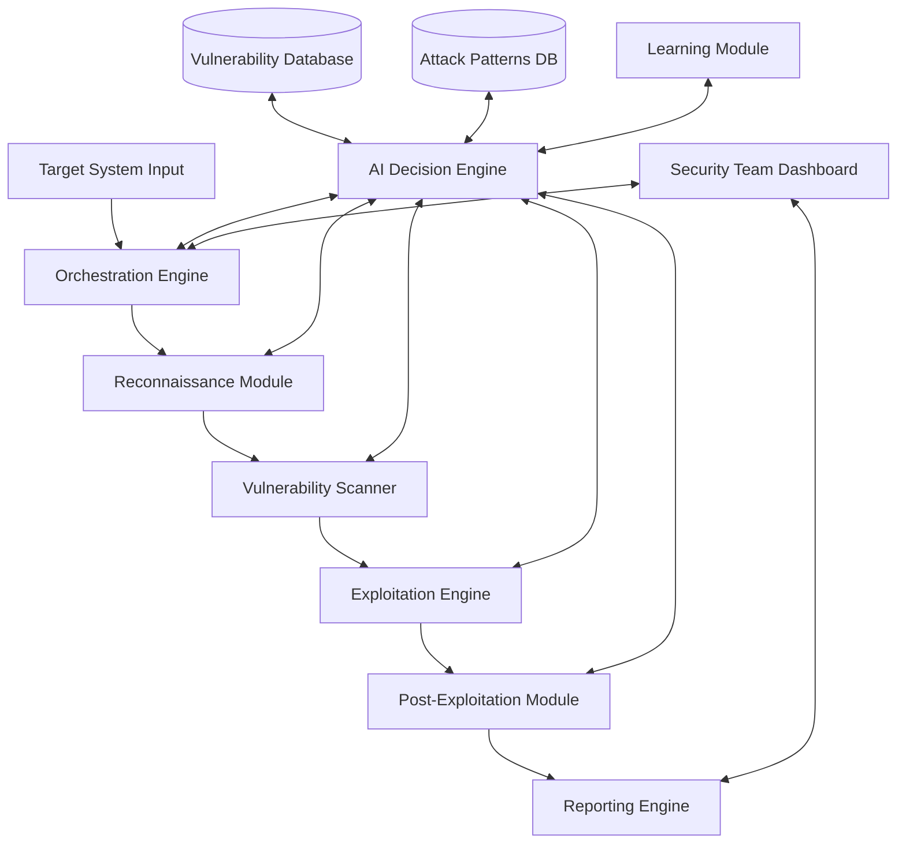

# System Architecture

```mermaid
flowchart TD
    A[Target System Input] --> B[Orchestration Engine]
    B --> C[Reconnaissance Module]
    C --> D[Vulnerability Scanner]
    D --> E[Exploitation Engine]
    E --> F[Post-Exploitation Module]
    F --> G[Reporting Engine]

    H[AI Decision Engine] <--> B
    H <--> C
    H <--> D
    H <--> E
    H <--> F
    
    I[(Vulnerability Database)] <--> H
    J[(Attack Patterns DB)] <--> H
    K[Learning Module] <--> H
    
    L[Security Team Dashboard] <--> B
    L <--> G
```
