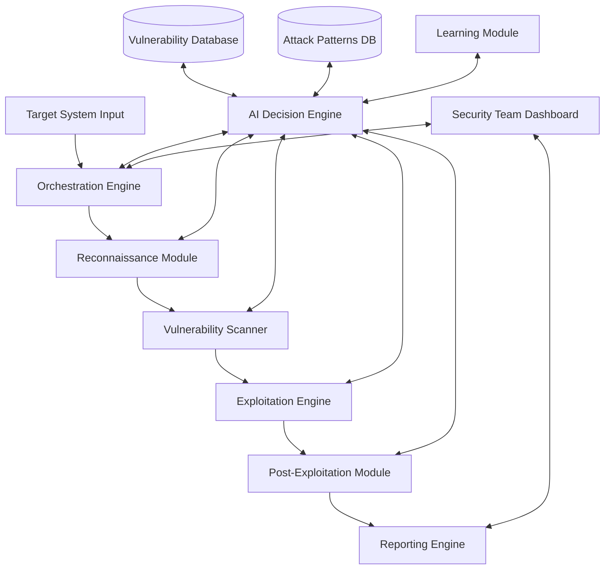

# SentinelProbe Architecture Overview

This document provides a high-level overview of the SentinelProbe architecture, its key components, and how they interact with each other.

## System Architecture

SentinelProbe is built using a modular architecture that allows for flexibility, scalability, and maintainability. The system is composed of several key components that work together to perform automated penetration testing.

## Core Components

### Orchestration Engine

**Purpose**: Central coordination hub that manages the testing workflow and communication between components.

**Key Functions**:

- Test initialization and configuration management
- Resource allocation and optimization
- State tracking and persistence across modules
- Error handling and recovery mechanisms
- Testing lifecycle management

### AI Decision Engine

**Purpose**: The intelligent brain of the system that analyzes information and determines optimal testing strategies.

**Key Functions**:

- Adaptive testing strategy formulation
- Vulnerability prioritization based on impact and exploitability
- Resource allocation optimization
- Testing path selection based on discovered information
- Risk assessment and mitigation planning
- Advanced correlation analysis for compound vulnerabilities
- Contextual scoring to adjust severity based on environment
- Adaptive rule learning for continuous improvement

### Reconnaissance Module

**Purpose**: Gathers intelligence about target systems to identify potential attack vectors.

**Key Functions**:

- Network discovery and mapping
- Service enumeration and fingerprinting
- Technology stack identification
- Open-source intelligence gathering
- Asset inventory and classification
- Advanced service detection and version identification

### Vulnerability Scanner

**Purpose**: Identifies security weaknesses in target systems through various testing methodologies.

**Key Functions**:

- Automated vulnerability detection across different layers
- Configuration weakness identification
- Compliance checking against security standards
- Custom vulnerability rule processing
- False positive reduction
- Plugin-based architecture for extensible scanning capabilities

### Exploitation Engine

**Purpose**: Safely attempts to exploit discovered vulnerabilities to validate their existence.

**Key Functions**:

- Exploit selection and customization
- Payload generation and delivery
- Exploitation attempt management
- Success/failure analysis
- Safe execution environment
- Plugin-based architecture for different exploit types

### Post-Exploitation Module

**Purpose**: Tests for privilege escalation, lateral movement, and persistence opportunities.

**Key Functions**:

- Privilege escalation testing
- Lateral movement simulation
- Data access control validation
- Persistence technique testing
- Defense evasion assessment
- System cleanup procedures

### Reporting Engine

**Purpose**: Generates comprehensive, actionable reports on identified vulnerabilities.

**Key Functions**:

- Vulnerability data aggregation and correlation
- Risk scoring and prioritization
- Evidence collection and management
- Remediation recommendation generation
- Report customization and delivery

### Learning Module

**Purpose**: Improves system performance over time through continuous learning.

**Key Functions**:

- Performance analysis and optimization
- Pattern recognition from past tests
- Technique effectiveness evaluation
- Model retraining and improvement
- Knowledge base expansion

## Data Flows

- **Target Profile Data**: User → Orchestration Engine → All Modules
- **Reconnaissance Data**: Reconnaissance Module → Vulnerability Database → AI Decision Engine
- **Vulnerability Data**: Vulnerability Scanner → Exploitation Engine → Reporting Engine
- **Exploitation Results**: Exploitation Engine → Post-Exploitation Module → Reporting Engine
- **Testing Strategy**: AI Decision Engine → Orchestration Engine → All Modules
- **Historical Data**: All Modules → Learning Module → AI Decision Engine

## Database Architecture

SentinelProbe uses a hybrid database approach:

- **PostgreSQL**: For structured data including:
  - Jobs and tasks
  - Test configurations
  - Decision rules and strategies
  - Target information and discovered services
  - User accounts and permissions

- **MongoDB**: For unstructured scan results including:
  - Detailed scan outputs
  - Raw vulnerability data
  - Evidence artifacts
  - Generated reports

## API and Integration Points

SentinelProbe exposes RESTful APIs for integration with other systems:

- **Job Management API**: Create, monitor, and manage scanning jobs
- **Results API**: Retrieve and query testing results
- **Configuration API**: Manage system configurations and rules
- **Integration API**: Webhooks and callbacks for CI/CD integration

## Security Considerations

The SentinelProbe architecture incorporates several security measures:

- Strict isolation between testing environments and the core system
- End-to-end encryption for sensitive data
- Comprehensive access control and permission management
- Audit logging for all system activities
- Secure credential storage

## Deployment Topology

SentinelProbe can be deployed in various configurations:

- **Single-Node Deployment**: All components on a single server (suitable for small deployments)
- **Distributed Deployment**: Components distributed across multiple servers for scalability
- **Containerized Deployment**: Docker-based deployment for ease of management
- **Kubernetes Deployment**: For large-scale, highly available deployments

## Next Steps

For more detailed information about each component, refer to the component-specific documentation:

- [Reconnaissance Module](components/reconnaissance.md)
- [AI Decision Engine](components/ai-decision-engine.md)
- [Vulnerability Scanner](components/vulnerability-scanner.md)
- [Exploitation Engine](components/exploitation-engine.md)
- [Post-Exploitation Module](components/post-exploitation.md)
- [Reporting Engine](components/reporting-engine.md)
